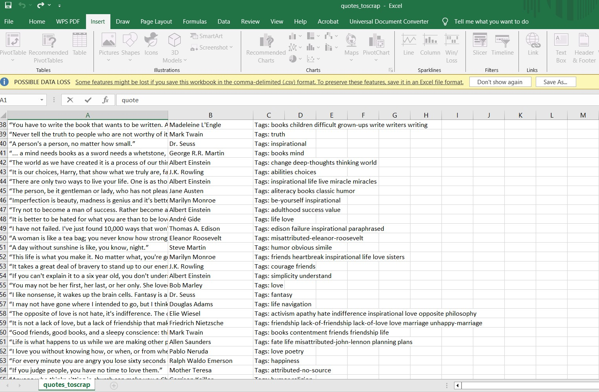

# Infinite Scroll Quotes Scraper

An advanced web scraping project built with Python and Selenium to handle
infinite-scrolling pages.

The scraper automatically extracts dynamic content such as quotes,
authors, and tags from a JavaScript-heavy website and exports the
collected data into a structured CSV file.

## Features

- Handles infinite scrolling
- Extracts dynamically loaded content
- Extracts quotes, authors, and tags
- Uses Selenium for browser automation
- Prevents duplicate data
- Exports data to CSV
- Handles dynamically loaded pages

## Technologies

- Python
- Selenium
- CSV

## How It Works

1. Opens the target website using Selenium.
2. Scrolls to the bottom of the page.
3. Waits for new content to load.
4. Extracts quotes, authors, and tags.
5. Continues scrolling until no new content is loaded.
6. Saves the collected data into a CSV file.

## Output

The extracted data is saved as:

`quotes_toscrap.csv`

### CSV Output



## Project Structure

```text
Infinite-Scroll-Quotes-Scraper/
│
├── Quotes.py
├── quotes_toscrap.csv
├── CSV_File_Screenshot.JPG
├── requirements.txt
└── README.md
